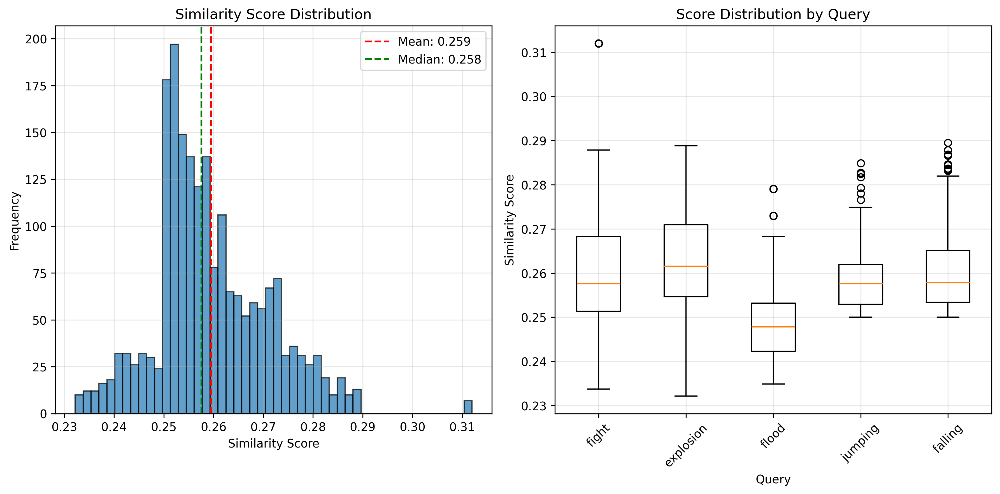

# CLIP Video Fragment Search

CLIP-based video fragment search system that finds 5-second clips matching text queries using scene detection.

## Prerequisites

Install FFmpeg and uv:
```bash
sudo apt install ffmpeg
curl -LsSf https://astral.sh/uv/install.sh | sh
```

## Setup

```bash
uv sync
```
----------------------------------------------------------
## Краткий обзор

Проект использует следующие технологии:
- CLIP (ViT-B/32) - vision-language модель для поиска похожих фрагментов
- PySceneDetect - детекция сцен внутри фильма
- FFmpeg - экстракция видео

Пайплайн работы системы следующий:
1. Индексация видео - мы индексируем видео и кэшируем результаты
2. Поиск похожих фрагментов - мы используем кэшированные результаты индексации и ищем похожие фрагменты
3. Извлечение фрагментов - мы извлекаем фрагменты из видео
4. Запись метаданных - мы записываем метаданные фрагментов в csv файл

----------------------------------------------------------

## Индексация и поиск

### Индексация видео (однократная операция)
```bash
python main.py index 
```

Обрабатывает все видео, определяет сцены, извлекает кадры и кэширует эмбеддинги CLIP.

### Поиск похожих фрагментов
```bash
python main.py search query "explosion" 
```

### Поиск по нескольким запросам
```bash
python main.py batch_search queries=[explosion,flood,fight]
```
Для более подробной информацией о параметрах, обратитесь к [conf/README.md](conf/README.md)

## Структура выходных данных

```
output/
├── explosion/
│   ├── film1_00120_00125.mp4
│   ├── film2_00340_00345.mp4
├── flood/
│   ├── film3_00089_00094.mp4
├── fight/
│   ├── film1_00567_00572.mp4
└── metadata.csv
```

`metadata.csv` содержит: file_path, start_time, end_time, query, similarity_score, source_film.

----------------------------------------------------------

## Оптимизации поиска

1. Подход с кешированием избавляет от необходжимости каждый раз индексировать видео заново, что позволяет проводить почти моментальный поиск похожих фрагментов. Однако первый запуск индексации занимает довольно много времени(на 10-ти фильмах ~20 минут), так как нужно обработать все видео.
2. Мы пропускаем первые и последние 30 секунд и 5 минут соответственно, чтобы избежать бесполезного контента (логотипы, титры). Дополнительно можно пропустить контент, который не содержит движения (например, статические кадры), с помощью optical flow.
3. Мы используем max pooling для агрегации скоров, чтобы выбрать лучшую последовательность кадров для фрагмента. Также можно использовать mean pooling, чтобы выбрать среднюю последовательность кадров для фрагмента. Например для поиска взрывов лучше использовать max pooling, а для драк - mean pooling.

----------------------------------------------------------

## Проблемы нынешнего подхода

1. Большое количество ложных срабатываний (false positives) - CLIP находит нерелевантные фрагменты. При этом даже небольшое увеличение порога сходства(0.25 -> 0.27) приводит к резкому снижению количества найденных фрагментов. Возможно стоит попробовать использовать модели больше и точнее, например CLIP ViT-L/14 или CLIP ViT-H/14. Также можно попробовать использовать negative filtering для уменьшения количества ложных срабатываний. Например модель часто путает танцы и драки, поэтому можно добавить запросы "dancing", "hugging", "shaking hands" в negative filtering.
2. Низкая скорость первоначальной индексации - первый запуск индексации занимает довольно много времени(на 10-ти фильмах ~20 минут), так как нужно обработать все видео. Стоит использовать параллельную обработку видео, чтобы ускорить процесс, а также установить параметр batch_size больше, чтобы ускорить энкодинг. 
3. Нет возможности масштабирования на большие коллекции - при большом количестве видео, время индексации и поиска будет увеличиваться. Возможно стоит использовать FAISS для масштабирования на большие коллекции. Также заменить .pkl файлы на memory-mapped файлы, чтобы экономить RAM.

----------------------------------------------------------

## Анализ данных после индексирования фильмов

После индексации фильмов я провел анализ данных и выяснил, что:
- При следующих гиперпараметрах: 
  - similarity_threshold: 0.27
  - aggregation_method: max
  - batch_size: 32
  - fragment_length: 5

Мы запросили следующие действия: explosion, flood, fight, jumping, falling.
Так для 10-ти фильмов и 5 запросов мы получили следующие результаты:
Общее количество фрагментов: 2014
Уникальных запросов: 5
Уникальных фильмов: 10
Средний скор: 0.259
Медианный скор: 0.258
Стандартное отклонение: 0.011
Диапазон скоров: [0.232, 0.312]

Также мы можем посмотреть на количество фрагментов для каждого запроса:
- explosion: 558 фрагментов (средний скор: 0.263)
- flood: 239 фрагментов (средний скор: 0.249)
- fight: 523 фрагментов (средний скор: 0.260)
- jumping: 201 фрагментов (средний скор: 0.259)
- falling: 193 фрагментов (средний скор: 0.257)



На графике видно, что большое кол-во фрагметов имеют скор 0.25-0.26, что говорит о том, что модель работает не очень хорошо.

## Анализ запросов по отдельности

### explosion

В целом, метод выбора отрывка по лучшему кадру хорошо работает здесь, так как взрывы чаще происходят в течении 1-2 секунд. Иногда модель путает взрывы с красочными эффектами, но в целом результаты достаточно хорошие.

### flood

Здесь модель выделила кадры с водой. Озера, водопады, дожди, лужи прочие проявления воды. Довольно сложный запрос для модели, т.к затопление в основном связано с водой, и в меньшей мере с тем, что затапливается. Поэтому в конечном варианте, основные срабатывания - вода.

### fight

Модель сработала достаточно хорошо. Драки в основном тянутся на протяжении всего сегмента, но иногда модель путает драки с другими действиями, например танцами.

